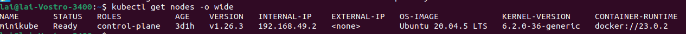

# cadvisor_prom_test
Requirement: A Kubernetes Cluster (Could be Minikube, kind,…)

To deploy the web application:

```bash
#create a persistance volume and persistance volume claim
kubectl apply -f persistance_volume.yaml
kubectl apply -f pv_claim.yaml

#deploy mongodb pod
kubectl apply -f mongo-config.yaml
kubectl apply -f mongo-secret.yaml
kubectl apply -f mongo.yaml

#deploy flask and nginx
kubectl apply -f flask.yaml
kubectl apply -f nginx.yaml
```

To access the web app:

- Check the ip of the node:

```bash
kubectl get node -o wide
```



- The node_ip is: 192.168.49.2
- On browser go to node_ip:30800 ([http://192.168.49.2:30800/](http://192.168.49.2:30800/) in this example)

To install cadvisor:

```bash
kubectl apply -f cadvisor.yaml
```

- Check cadvisor pod name: kubectl get pod -o wide -n kube-system
- Open port to access cadvisor web UI: kubectl -n kube-system port-forward pod/{replace_this_with_cadvisor_pod_name} 8080:8080

To install Prometheus:

```bash
kubectl apply -f prom-clusterRole.yaml
kubectl apply -f prom-configMap.yaml
kubectl apply -f prom-deploy.yaml
kubectl apply -f prom-service.yaml
```

- To access Prometheus web UI: node_ip:30000